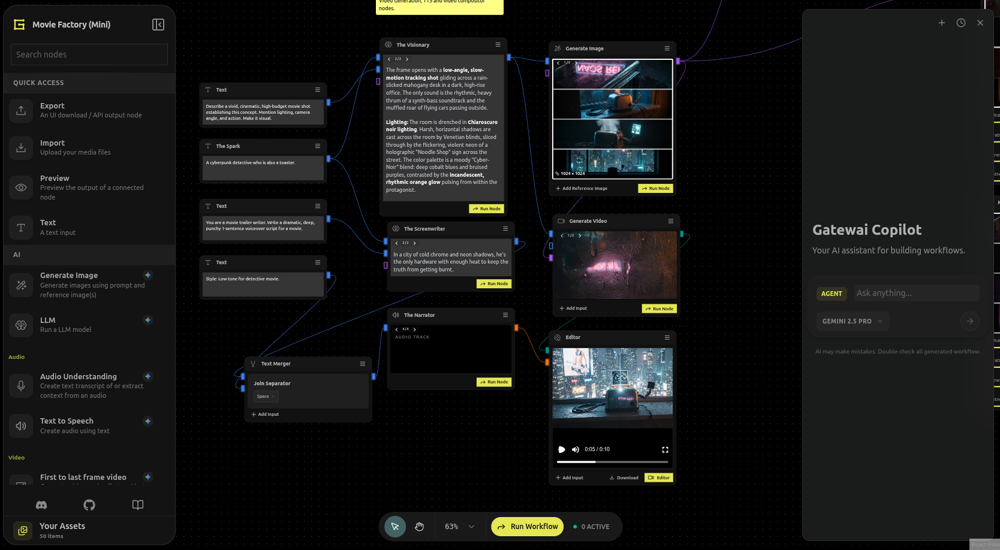
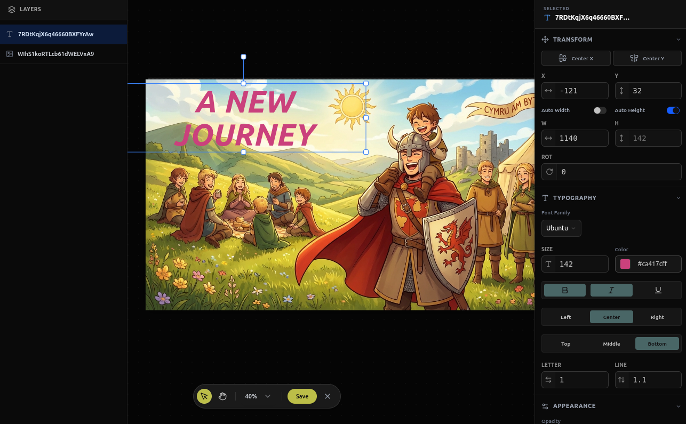
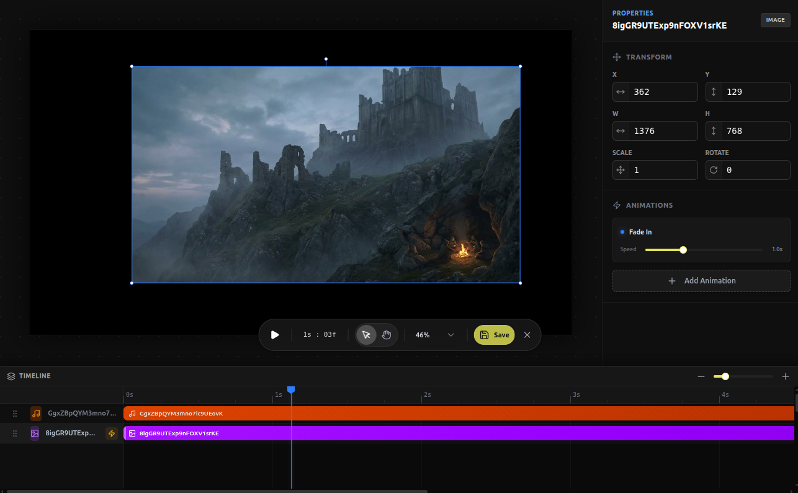

# GATEWAI

Gatewai is a powerful, node-based vibeflow platform designed to bridge the gap between complex AI models and intuitive creative workflows. Whether you are generating cinematic videos, composing multi-layered images, or building sophisticated LLM chains, Gatewai provides the canvas for your imagination through a sleek, user-centric interface.

> [!WARNING]
> This project is built for the Gemini 3 Hackathon. For that reason, **main branch is freezed for Hackathon submission until March.** We'll continue building Gatewai in **dev** branch for latest updates. [Drop us a like](https://devpost.com/software/gatewai-ylt5uo)

---

## Key Pillars

### Adaptive Execution Engine

Gatewai utilizes a **Flexible Hybrid Model** where nodes are processed across both the frontend and backend. Rather than adhering to rigid roles, our engine evaluates the requirements of each task—from real-time canvas manipulations to heavy AI operations—and executes them in the browser or on the backend as needed for optimal performance.

### Multi-Modal Mastery

Stop switching between tools. Gatewai offers a unified interface for:

* **Video**: Text-to-video and first-to-last frame interpolation powered by **Veo 3.1**, alongside professional video composition tools.
* **Image**: Generative fill, real-time painting, and advanced editing tools (Blur, Crop, Modulate, etc.), with image generation powered by **Nano Banana**.
* **Audio**: High-fidelity text-to-speech and deep audio understanding via the latest **Gemini 3** models.
* **Text**: LLM orchestration using **Gemini 3 Flash or Pro**, depending on your specific use case.

### Real-Time Creativity

Don't wait for results. Our interactive canvas provides instant feedback, enabling a fluid process where AI becomes a natural extension of your creativity. Gatewai utilizes **WebGL rendering** on both the server and browser to ensure pixel-perfect parity. What you see in the browser is exactly what the AI processes, and vice versa.

### Headless Architecture

Gatewai is built with a **backend-first philosophy**. The execution engine is fully decoupled from the UI, meaning workflows can be executed "headlessly" via API without ever instantiating a browser session. This architecture enables developers to embed Gatewai's powerful generative pipelines directly into their own applications.

Crucially, our **Unified Rendering Engine** ensures consistency. By injecting **Headless GL** on the server and **WebGL** in the client into a shared core, complex media compositions generated on the backend are pixel-perfect matches to the real-time browser preview.

---

## Features at a Glance

* **Cinematic Video Suite**: Generate, extend, and interpolate videos with professional-grade control.
* **AI-Powered Paint**: Draw, mask, fill, crop, resize, blur and modulate with precision directly on the canvas.
* **Intelligent Compositor**: Merge images, text, and AI outputs into complex, multi-layered masterpieces.
* **Modular LLM Chains**: Build sophisticated logic by connecting LLMs with real-world media assets.
* **Gatewai Copilot**: Use our integrated assistant to build modular, extensible workflow logic where every entity functions as a dynamic variable.
* **Asset Management**: Unified handling of all media assets with secure, cloud-native storage.

### Media Editing 🎬 🎥 🎞️ 🍿

Gatewai ships with dedicated image and video compositior nodes, removing the barriers between your vision and the final masterpiece.

| Image Composition Node Editor | Video Composition Node Editor |
| :---: | :---: |
|  |  |

---

## 🤖 Gatewai Copilot

Gatewai's intelligent agent system uses a sophisticated multi-agent architecture to co-create with you.

* **Orchestrator Agent**: Powered by **Gemini 3**, it understands your high-level intent, analyzes the current canvas state, and plans workflow modifications.
* **Patcher Sub-Agent**: A specialized coding agent that safely generates and verifies JavaScript to manipulate the canvas graph. It executes in a sandboxed secure environment to ensure structural integrity (correct handle types, valid connections) before any changes are applied.
* **Tought Signatures**: Copilot uses thought signatures for more compact, yet detailed, reasoning, reducing token usage and improving response times.
* **Context Aware**: The agent has full visibility into your node templates (`ImageGen`, `VideoCompositor`, etc.) and seamlessly bridges natural language with complex graph operations.
* **See differences**: When agent prepares the changes for your workflow, it shows you the differences between the current graph and the new graph. It is up to you to accept it or reject it and clarify your intent.

---

## Getting Started

### Installation

See [INSTALLATION.md](https://github.com/gatewai-dev/Gatewai/blob/main/docs/INSTALLATION.md)

### Community & Support

* **Show Your Support ⭐**: Help us grow by starring the repository!
* **Discord**: Connect with other creators, share workflows, and vote on upcoming features in our [Community Discord](https://discord.gg/ha4A8UD7kn).

---

## License

See [LICENSE](https://github.com/gatewai-dev/Gatewai/blob/main/LICENCE)