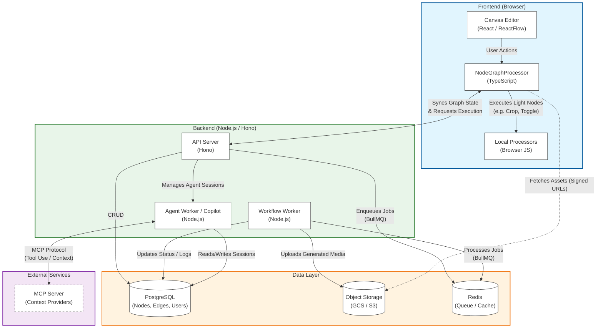

# Gatewai System Architecture

This document visualizes the high-level architecture of the Gatewai platform, illustrating the hybrid execution model, data flow, and key components.

## Component Overview

### Frontend (Browser)
- **Canvas Editor**: The primary UI for constructing generative workflows.
- **NodeGraphProcessor**: The client-side engine that orchestrates execution. It identifies which nodes can be run locally and which must be offloaded to the server.
- **Local Processors**: Performs lightweight operations (e.g., cropping, boolean logic) directly in the browser to reduce latency.

### Backend (Node.js/Hono)
- **API Server**: The central entry point for authentication, graph management, and session handling.
- **Workflow Worker**: A dedicated background worker for executing resource-intensive "Terminal Nodes" (e.g., ImageGen, VideoGen). It consumers jobs from the Redis queue.
- **Agent Worker (Copilot)**: Manages usage of the AI Agent (Copilot) for tasks like "Patch this canvas" or answering questions. Interacts with the MCP server.

### External Services
- **MCP Server**: Implements the Model Context Protocol to provide the Agent with tools and context about the codebase or external systems.

### Data Layer
- **PostgreSQL**: The source of truth for all structured data (users, canvases, node configurations).
- **Redis (BullMQ)**: Handles the asynchronous task queue for the Workflow Worker, ensuring reliable execution and retries for generative tasks.
- **Object Storage**: High-capacity storage for media assets (images, videos) generated by the workflow.
