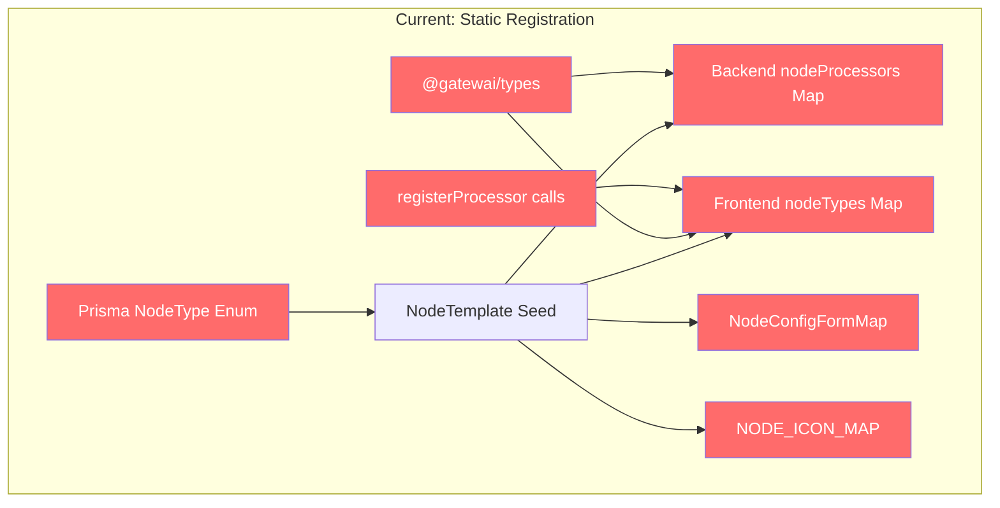
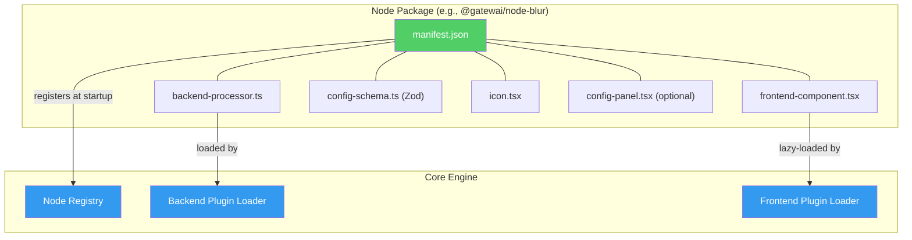
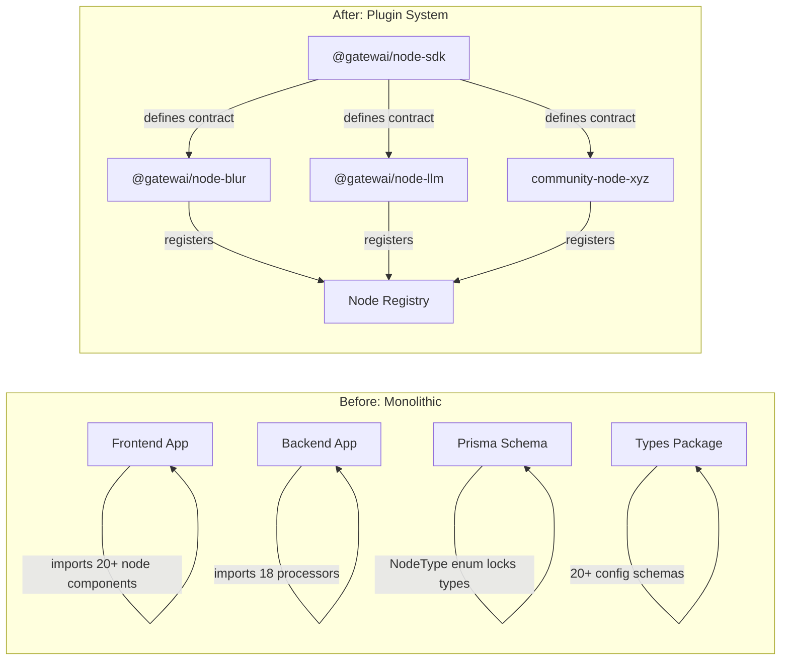

# Gatewai Node Modularity Roadmap

## Executive Summary

Today, every node in Gatewai (Blur, Crop, LLM, etc.) is woven into the monolith through **7 hardcoded registration points**. This roadmap describes how to extract nodes into standalone, independently-publishable packages so that **users can develop, install, and share their own nodes**.

---

## Current Architecture: Where Nodes Are Coupled

Every node touches the codebase in these 7 places:

| # | Coupling Point | File(s) | What it does |
|---|---|---|---|
| 1 | **Prisma `NodeType` enum** | [schema.prisma](file:///home/okanasl/gatewai/packages/db/prisma/schema.prisma#L12-L35) | Hardcoded enum of all node types in DB schema |
| 2 | **Backend processor map** | [processors/index.ts](file:///home/okanasl/gatewai/apps/gatewai-fe/backend/src/graph-engine/processors/index.ts) | `NodeType → NodeProcessor` static mapping |
| 3 | **Frontend component map** | [nodes/index.tsx](file:///home/okanasl/gatewai/apps/gatewai-fe/src/routes/canvas/details/nodes/index.tsx) | `nodeTypes` registry for ReactFlow |
| 4 | **Config panel map** | [node-config/index.tsx](file:///home/okanasl/gatewai/apps/gatewai-fe/src/routes/canvas/details/reactflow-container/right-panel/node-config/index.tsx) | `NodeConfigFormMap` for settings UI |
| 5 | **Icon map** | [icon-map.tsx](file:///home/okanasl/gatewai/apps/gatewai-fe/src/routes/canvas/details/node-templates/node-palette/icon-map.tsx) | `NODE_ICON_MAP` for palette/node icons |
| 6 | **Types package** | [config/schemas.ts](file:///home/okanasl/gatewai/packages/types/src/config/schemas.ts), [node-result.ts](file:///home/okanasl/gatewai/packages/types/src/node-result.ts) | Per-node Zod config schemas + result type union |
| 7 | **Frontend graph processors** | [node-graph-processor.ts](file:///home/okanasl/gatewai/apps/gatewai-fe/src/routes/canvas/details/graph-engine/node-graph-processor.ts#L1091-L1454) | Inline [registerProcessor()](file:///home/okanasl/gatewai/apps/gatewai-fe/src/routes/canvas/details/graph-engine/node-graph-processor.ts#467-473) calls for client-side node processing |



> [!IMPORTANT]
> The biggest blocker is the **Prisma `NodeType` enum**. Since it's a Postgres enum, adding a new node today requires a DB migration. This must change to a `String` field before true plug-and-play is possible.

---

## Target Architecture



Each node package exports a **single manifest** that the core engine consumes at startup:

```typescript
// @gatewai/node-sdk - the contract
interface GatewaiNodeManifest {
  // Identity
  type: string;                    // unique slug, e.g. "blur"
  displayName: string;
  description?: string;
  category: string;
  subcategory?: string;
  version: string;

  // I/O contract
  handles: {
    inputs: HandleDefinition[];
    outputs: HandleDefinition[];
  };
  variableInputs?: { enabled: boolean; dataTypes: DataType[] };
  variableOutputs?: { enabled: boolean; dataTypes: DataType[] };

  // Execution
  isTerminal: boolean;             // runs on server?
  isTransient?: boolean;

  // Config
  configSchema?: ZodSchema;        // Zod schema for validation
  defaultConfig?: Record<string, unknown>;

  // Processing
  backendProcessor?: NodeProcessor;
  frontendProcessor?: FrontendNodeProcessor;

  // UI (optional - defaults provided by core)
  icon?: FC<{ className?: string }>;
  nodeComponent?: FC<NodeProps>;
  configPanelComponent?: FC<{ node: NodeEntityType }>;
}
```

---

## Phased Roadmap

### Phase 1: Node SDK Package 📦
**Goal:** Define the plugin contract; no runtime changes yet.

| Task | Details |
|---|---|
| Create `packages/node-sdk` | The shared manifest interface, `HandleDefinition`, base types, helper utilities |
| Extract resolver helpers | Move [getInputValue](file:///home/okanasl/gatewai/apps/gatewai-fe/backend/src/graph-engine/resolvers.ts#42-102), [loadMediaBuffer](file:///home/okanasl/gatewai/apps/gatewai-fe/backend/src/graph-engine/resolvers.ts#158-183), etc. from [graph-engine/resolvers.ts](file:///home/okanasl/gatewai/apps/gatewai-fe/backend/src/graph-engine/resolvers.ts) → `node-sdk/helpers` so node authors can use them |
| Define `GatewaiNodeManifest` | The interface above — the single export a node package needs |
| Create a `defineNode()` helper | Type-safe factory: `defineNode({ type: "blur", ... })` |

> [!TIP]
> This phase has **zero breaking changes** — it's purely additive.

---

### Phase 2: Migrate Built-in Nodes to Manifest Format 🔄
**Goal:** Port existing nodes to the new contract *in-place*, prove the API works.

Each existing node (e.g., Blur) would become a self-contained manifest:

```
packages/nodes/
├── blur/
│   ├── package.json
│   ├── manifest.ts         ← exports defineNode(...)
│   ├── backend-processor.ts
│   ├── frontend-component.tsx
│   ├── config-panel.tsx    (if applicable)
│   └── icon.tsx
├── llm/
│   └── ...
├── crop/
│   └── ...
└── index.ts                ← re-exports all built-in manifests
```

| Task | Details |
|---|---|
| Create `packages/nodes/<name>/` for each node | Move processor, component, config panel, icon into the package |
| Export manifest from each | Each exports `default` from `manifest.ts` using `defineNode()` |
| Create `packages/nodes/index.ts` | Central aggregator that re-exports the built-in manifests as an array |
| Keep existing static maps working | Import from `packages/nodes` instead of inline — **no runtime behavior change** |

**Example: Blur Node Package**

```typescript
// packages/nodes/blur/manifest.ts
import { defineNode } from "@gatewai/node-sdk";
import { BlurNodeConfigSchema } from "./config-schema";
import blurProcessor from "./backend-processor";
import { BlurNodeComponent } from "./frontend-component";
import { BlurConfigPanel } from "./config-panel";
import { PiCloudFog } from "react-icons/pi";

export default defineNode({
  type: "Blur",
  displayName: "Blur",
  category: "Image",
  subcategory: "Filters",
  isTerminal: true,
  handles: {
    inputs: [
      { dataTypes: ["Image"], label: "Image", required: true, order: 0 },
    ],
    outputs: [
      { dataTypes: ["Image"], label: "Output", order: 0 },
    ],
  },
  configSchema: BlurNodeConfigSchema,
  defaultConfig: { size: 5 },
  backendProcessor: blurProcessor,
  nodeComponent: BlurNodeComponent,
  configPanelComponent: BlurConfigPanel,
  icon: PiCloudFog,
});
```

---

### Phase 3: Dynamic Registry & Loaders ⚡
**Goal:** Replace static maps with a dynamic registry that consumes manifests at runtime.

#### Backend Changes

```diff
- // Static map in processors/index.ts
- const nodeProcessors: Partial<Record<NodeType, NodeProcessor>> = {
-   [NodeType.Blur]: blurProcessor,
-   ...
- };

+ // Dynamic registry
+ class NodeRegistry {
+   private processors = new Map<string, NodeProcessor>();
+   private manifests = new Map<string, GatewaiNodeManifest>();
+
+   register(manifest: GatewaiNodeManifest) { ... }
+   getProcessor(type: string): NodeProcessor | undefined { ... }
+   getManifest(type: string): GatewaiNodeManifest | undefined { ... }
+   getAllManifests(): GatewaiNodeManifest[] { ... }
+ }
```

| Task | Details |
|---|---|
| Create `NodeRegistry` class (backend) | Dynamic `Map<string, NodeProcessor>` replacing static `nodeProcessors` |
| Auto-register built-in nodes at server startup | Import from `packages/nodes`, loop through manifests, call `registry.register()` |
| Add `/api/node-types` endpoint | Returns manifests (sans processor functions) to the frontend for palette rendering |
| Update [NodeWFProcessor](file:///home/okanasl/gatewai/apps/gatewai-fe/backend/src/graph-engine/canvas-workflow-processor.ts#15-257) | Use `registry.getProcessor(node.type)` instead of `nodeProcessors[node.type]` |

#### Frontend Changes

| Task | Details |
|---|---|
| Create `FrontendNodeRegistry` | Dynamic map replacing `nodeTypes`, `NodeConfigFormMap`, `NODE_ICON_MAP` |
| Fetch manifest metadata from API | Use `/api/node-types` for the palette instead of hardcoded `NodeTemplate` query |
| Use `React.lazy()` for node components | Load node components dynamically from their package |
| Update `NodeGraphProcessor.registerProcessors()` | Loop from registry instead of inline calls |

---

### Phase 4: Decouple the Database Schema 🗄️
**Goal:** Remove the last hard dependency — the Prisma `NodeType` enum.

> [!CAUTION]
> This is the most sensitive phase. It requires a migration on production data.

| Task | Details |
|---|---|
| Change `Node.type` from `NodeType` enum → `String` | Prisma migration: `ALTER TABLE node ALTER COLUMN type TYPE TEXT` |
| Change `NodeTemplate.type` from `NodeType` enum → `String` | Same approach |
| Drop the `NodeType` enum | After migration, remove from [schema.prisma](file:///home/okanasl/gatewai/packages/db/prisma/schema.prisma) |
| Update all `NodeType` references in TS code | Replace `NodeType.Blur` → `"Blur"` (or import string constants from each node package) |
| Seed node templates dynamically | Instead of seed script, have the registry create/update templates on startup |

**Migration Strategy:**
1. Add a parallel `typeStr String?` column
2. Backfill from enum
3. Swap application code to use `typeStr`
4. Drop the enum column
5. Rename `typeStr` → `type`

---

### Phase 5: Developer Experience & Ecosystem 🌐
**Goal:** Make it trivial for external developers to build and share nodes.

| Task | Details |
|---|---|
| `@gatewai/create-node` CLI | `npx @gatewai/create-node my-node` scaffolds the boilerplate |
| Node SDK documentation | API reference, tutorials, example nodes |
| Node loading from `node_modules` | Scan `node_modules/@gatewai/node-*` or `gatewai-node-*` at startup |
| Validation & sandboxing | Validate manifests at registration, sandbox third-party code |
| Hot-reload in dev mode | Watch node package directories, re-register on change |
| Community marketplace (future) | Registry/gallery for sharing community nodes |

---

## Architecture Diagram: Before & After



---

## Migration Priority & Impact

| Phase | Breaking Changes | Effort | Risk |
|---|---|---|---|
| **Phase 1** — Node SDK | None | Small | Very low |
| **Phase 2** — Migrate built-ins | None (internal refactor) | Medium | Low |
| **Phase 3** — Dynamic registry | Internal API changes | Medium-Large | Medium |
| **Phase 4** — DB schema | DB migration required | Medium | High |
| **Phase 5** — DX & ecosystem | None | Large | Low |

---

## Recommended Execution Order

> [!NOTE]
> Phases 1–2 can be done incrementally alongside feature work. Phase 3–4 are best done as focused sprints.

1. **Start with Phase 1** — Purely additive, no risk. Defines the target contract.
2. **Migrate 2–3 nodes in Phase 2** — Proves the manifest API works before full migration.
3. **Complete Phase 2** — Port all remaining nodes.
4. **Phase 3** — Build the dynamic loaders, switch over.
5. **Phase 4** — DB migration (do this after Phase 3 so the app code is already using strings).
6. **Phase 5** — Polish, docs, CLI, marketplace.

---

## Key Design Decisions to Make

1. **Monorepo vs. separate repos for node packages?**
   - Recommendation: Keep built-in nodes in-monorepo under `packages/nodes/*`, community nodes as external packages.

2. **Frontend component loading strategy?**
   - Option A: Static imports aggregated at build time (simpler, works now)
   - Option B: Dynamic `import()` with lazy loading (required for external nodes)
   - Recommendation: Start with A for built-ins, add B in Phase 5.

3. **How to handle node-specific backend dependencies?**
   - Each node package declares its own `peerDependencies`. The backend loader validates they're available.

4. **Versioning strategy for node packages?**
   - Each node package has its own semver. The SDK package defines the minimum compatible contract version.