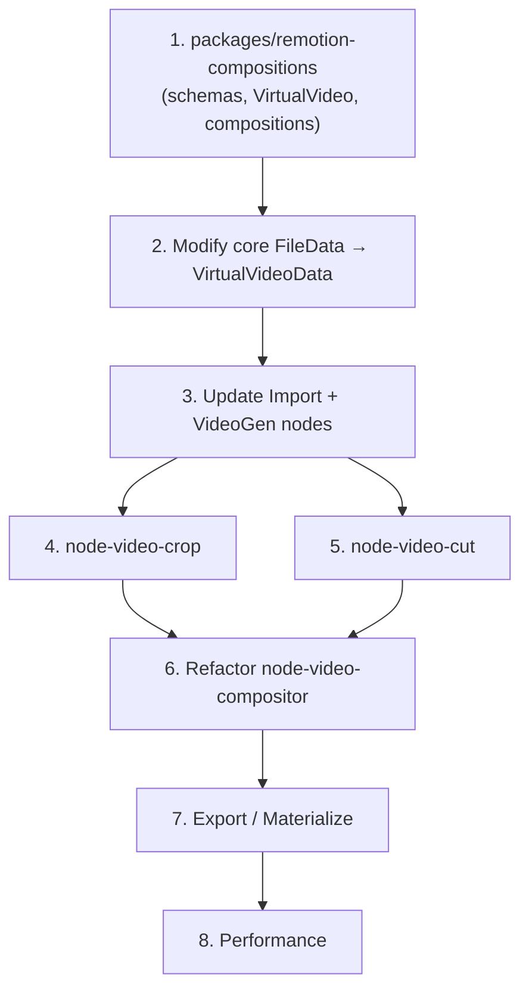

# Video Editing & Processing Implementation Spec

> **Goal**: Build a fast, elegant, Remotion-powered video editing pipeline with excellent node-developer DX — using **VirtualVideo as the native data type** for all video outputs, enabling zero-cost node chaining through declarative operation stacks.

---

## 1. Current Architecture Analysis

### 1.1 Node Structure Convention

Every node follows a three-part structure:

```
nodes/<node-name>/src/
├── metadata.ts          # defineMetadata() — type, handles, config/result schemas, defaults
├── shared/
│   ├── config.ts        # Zod schemas (config + result), shared between browser & server
│   └── index.ts         # Re-exports
├── browser/
│   ├── index.ts         # defineClient() — Component, ConfigComponent, PageContentComponent, processor
│   ├── <component>.tsx  # React node component (rendered on canvas)
│   └── processor.ts     # IBrowserProcessor — runs in-browser during preview/processing
└── server/
    ├── index.ts         # defineNode() — backendProcessor, optional router
    ├── processor.ts     # NodeProcessor (injectable) — server-side processing
    └── router.ts        # (optional) Hono router for custom endpoints
```

**Key SDK surfaces:**

| Function | Location | Purpose |
|---|---|---|
| `defineMetadata()` | `@gatewai/node-sdk` | Declares node type, handles, schemas |
| `defineClient()` | `@gatewai/node-sdk/browser` | Registers `Component`, `ConfigComponent`, `PageContentComponent`, `processor` |
| `defineNode()` | `@gatewai/node-sdk/server` | Registers `backendProcessor`, optional `router` |

### 1.2 Current Data Flow (Problem)

Currently, `OutputItem<"Video">` carries `data: FileData` — a concrete file reference. If a user chains `Import → Crop → Invert → Compositor`, every node must **fully render** to produce a file. This is slow, lossy, and wasteful.

### 1.3 Current Nodes (Summary)

- **Video Compositor** — Remotion-based multi-layer compositing with 2,520-line monolithic editor. No filters, no per-layer crop/trim/speed. Duplicated composition code.
- **Video Gen** — AI generation via Google Veo (server-side), outputs `FileData` with stored asset.
- **Import** — File upload, outputs `FileData` with stored asset.
- **Crop/Blur** — Image-only processing via PixiJS, NOT video-capable.

---

## 2. Core Concept: VirtualVideo as the Native Video Type

### 2.1 Design Principle

> **`OutputItem<"Video">` data IS `VirtualVideoData`. Always. No exceptions.**

Every node that produces a Video output — Import, VideoGen, Compositor, Crop, Cut — outputs `VirtualVideoData`. There is no fallback pattern, no `wrapAsVirtual()`, no checking. Downstream nodes always receive `VirtualVideoData` and can rely on its shape.

### 2.2 VirtualVideoData Schema

```ts
// packages/remotion-compositions/src/schemas/virtual-video.ts

import { z } from "zod";

// --- Source: the real underlying file ---
export const VideoSourceSchema = z.object({
  entity: z.any().optional(),           // FileAsset from Import/VideoGen
  processData: z.object({
    dataUrl: z.string(),
    width: z.number().optional(),
    height: z.number().optional(),
    duration: z.number().optional(),     // ms
    fps: z.number().optional(),
    mimeType: z.string().optional(),
    tempKey: z.string().optional(),
  }).optional(),
});

// --- Operations ---
export const CropOperationSchema = z.object({
  op: z.literal("crop"),
  x: z.number().min(0),
  y: z.number().min(0),
  width: z.number().min(1),
  height: z.number().min(1),
});

export const CutOperationSchema = z.object({
  op: z.literal("cut"),
  startSec: z.number().min(0),
  endSec: z.number().min(0).nullable(),  // null = to end
});

export const SpeedOperationSchema = z.object({
  op: z.literal("speed"),
  rate: z.number().min(0.25).max(4.0),
});

export const FilterOperationSchema = z.object({
  op: z.literal("filter"),
  filters: VideoFilterSchema,
});

export const FlipOperationSchema = z.object({
  op: z.literal("flip"),
  horizontal: z.boolean().default(false),
  vertical: z.boolean().default(false),
});

export const RotateOperationSchema = z.object({
  op: z.literal("rotate"),
  degrees: z.number(),
});

export const ComposeOperationSchema = z.object({
  op: z.literal("compose"),
  layers: z.array(z.any()),
  width: z.number(),
  height: z.number(),
  fps: z.number(),
  durationInFrames: z.number(),
});

export const VideoOperationSchema = z.discriminatedUnion("op", [
  CropOperationSchema,
  CutOperationSchema,
  SpeedOperationSchema,
  FilterOperationSchema,
  FlipOperationSchema,
  RotateOperationSchema,
  ComposeOperationSchema,
]);

export type VideoOperation = z.infer<typeof VideoOperationSchema>;

// --- VirtualVideoData: THE data type for all Video outputs ---
export const VirtualVideoDataSchema = z.object({
  /** Original source file */
  source: VideoSourceSchema,

  /** Source dimensions/duration before any operations */
  sourceMeta: z.object({
    width: z.number().optional(),
    height: z.number().optional(),
    durationMs: z.number().optional(),
    fps: z.number().optional(),
  }),

  /** Ordered operation stack (each node appends to this) */
  operations: z.array(VideoOperationSchema).default([]),
});

export type VirtualVideoData = z.infer<typeof VirtualVideoDataSchema>;
```

### 2.3 Update to Core Type System

#### Modify `packages/core/src/types/node-result.ts`

The `DataForType<"Video">` mapping changes from `FileData` to `VirtualVideoData`:

```diff
-export type DataForType<R extends DataType> = R extends "Text"
-  ? string
-  : R extends "Image" | "Audio" | "Video"
-    ? FileData
-    : ...;
+export type DataForType<R extends DataType> = R extends "Text"
+  ? string
+  : R extends "Image" | "Audio"
+    ? FileData
+    : R extends "Video"
+      ? VirtualVideoData    // Video outputs are ALWAYS VirtualVideo
+      : ...;
```

`FileData` remains unchanged and is still used for Image and Audio. `VirtualVideoData` is a new type specifically for video that embeds its source and operation history.

### 2.4 Core Utility Functions

```ts
// packages/remotion-compositions/src/utils/resolve-video.ts

/**
 * Resolve the actual playable URL from a VirtualVideoData
 */
export function resolveVideoSourceUrl(vv: VirtualVideoData): string | undefined {
  return vv.source.entity?.id
    ? GetAssetEndpoint(vv.source.entity)
    : vv.source.processData?.dataUrl;
}

/**
 * Create a VirtualVideoData from a FileData source (used by Import, VideoGen)
 */
export function createVirtualVideo(source: FileData): VirtualVideoData {
  return {
    source: {
      entity: source.entity,
      processData: source.processData,
    },
    sourceMeta: {
      width: source.entity?.width ?? source.processData?.width,
      height: source.entity?.height ?? source.processData?.height,
      durationMs: source.entity?.duration ?? source.processData?.duration,
      fps: source.processData?.fps,
    },
    operations: [],
  };
}

/**
 * Append an operation to an existing VirtualVideoData (used by processing nodes)
 */
export function appendOperation(
  vv: VirtualVideoData,
  operation: VideoOperation,
): VirtualVideoData {
  return {
    ...vv,
    operations: [...vv.operations, operation],
  };
}

/**
 * Collapse the full operation stack into concrete render parameters
 * for Remotion or FFmpeg
 */
export function computeRenderParams(vv: VirtualVideoData) {
  let trimStartSec = 0;
  let trimEndSec: number | null = null;
  let speed = 1.0;
  let cropRegion: { x: number; y: number; width: number; height: number } | null = null;
  let flipH = false;
  let flipV = false;
  let rotation = 0;
  const filters = { brightness: 100, contrast: 100, saturation: 100, hueRotate: 0, blur: 0, grayscale: 0, sepia: 0, invert: 0 };

  for (const op of vv.operations) {
    switch (op.op) {
      case "cut":
        trimStartSec = op.startSec;
        trimEndSec = op.endSec;
        break;
      case "speed":
        speed *= op.rate;
        break;
      case "crop":
        cropRegion = { x: op.x, y: op.y, width: op.width, height: op.height };
        break;
      case "filter":
        Object.assign(filters, mergeFilters(filters, op.filters));
        break;
      case "flip":
        if (op.horizontal) flipH = !flipH;
        if (op.vertical) flipV = !flipV;
        break;
      case "rotate":
        rotation = (rotation + op.degrees) % 360;
        break;
    }
  }

  const sourceUrl = resolveVideoSourceUrl(vv);
  const sourceDurationSec = (vv.sourceMeta.durationMs ?? 0) / 1000;
  const effectiveDurationSec = ((trimEndSec ?? sourceDurationSec) - trimStartSec) / speed;

  return {
    sourceUrl,
    trimStartSec, trimEndSec, speed,
    cropRegion, flipH, flipV, rotation,
    cssFilterString: buildCSSFilterString(filters),
    effectiveDurationSec,
  };
}
```

---

## 3. Node Changes

### 3.1 Source Nodes — Output VirtualVideoData Natively

#### Import Node (`nodes/node-import`)

**Changes to `browser/processor.ts`:**

```ts
import { createVirtualVideo } from "@gatewai/remotion-compositions";

// When the imported file is a Video, output VirtualVideoData
if (dataType === "Video") {
  return {
    selectedOutputIndex: 0,
    outputs: [{
      items: [{
        type: "Video",
        data: createVirtualVideo({ entity: asset }),  // VirtualVideoData, not FileData
        outputHandleId: outputHandle,
      }],
    }],
  };
}
// Image and Audio still output FileData as before
```

**Changes to `server/processor.ts`:** Same pattern — wrap in `createVirtualVideo()`.

**Changes to `shared/config.ts` — Result schema:**

```ts
export const ImportResultSchema = z.union([
  MultiOutputGenericSchema(
    createOutputItemSchema(z.literal("Video"), VirtualVideoDataSchema),  // NEW
  ),
  MultiOutputGenericSchema(
    createOutputItemSchema(z.literal("Image"), FileDataSchema),
  ),
  MultiOutputGenericSchema(
    createOutputItemSchema(z.literal("Audio"), FileDataSchema),
  ),
]);
```

#### Video Gen Node (`nodes/node-video-gen`)

**Changes to `server/processor.ts`:**

```ts
import { createVirtualVideo } from "@gatewai/remotion-compositions";

// After generating video and creating asset:
const newGeneration = {
  items: [{
    type: DataType.Video,
    data: createVirtualVideo({ entity: asset }),  // VirtualVideoData, not FileData
    outputHandleId: outputHandle.id,
  }],
};
```

**Changes to `shared/config.ts`:**

```ts
export const VideoGenResultSchema = MultiOutputGenericSchema(
  createOutputItemSchema(z.literal("Video"), VirtualVideoDataSchema),  // NEW
);
```

---

### 3.2 New Atomic Node: `node-video-crop`

> Crops the visible area of a video clip.

#### Directory Structure

```
nodes/node-video-crop/
└── src/
    ├── metadata.ts
    ├── shared/
    │   ├── config.ts
    │   └── index.ts
    ├── browser/
    │   ├── index.ts
    │   ├── video-crop-node-component.tsx
    │   ├── video-crop-config-component.tsx
    │   └── processor.ts
    └── server/
        ├── index.ts
        └── processor.ts
```

#### Metadata

```ts
export default defineMetadata({
  type: "VideoCrop",
  displayName: "Crop Video",
  description: "Crop the visible area of a video clip.",
  category: "Video",
  configSchema: VideoCropConfigSchema,
  resultSchema: VideoCropResultSchema,
  isTerminal: false,
  isTransient: false,
  handles: {
    inputs: [
      { dataTypes: ["Video"], required: true, label: "Video", order: 0 },
    ],
    outputs: [
      { dataTypes: ["Video"], label: "Result", order: 0 },
    ],
  },
  defaultConfig: {
    x: 0,
    y: 0,
    width: null,   // null = source width
    height: null,  // null = source height
  },
});
```

#### Config Schema

```ts
export const VideoCropConfigSchema = z.object({
  x: z.number().min(0).default(0),
  y: z.number().min(0).default(0),
  width: z.number().min(1).nullable().default(null),
  height: z.number().min(1).nullable().default(null),
}).strict();

export type VideoCropConfig = z.infer<typeof VideoCropConfigSchema>;

export const VideoCropResultSchema = SingleOutputGenericSchema(
  createOutputItemSchema(z.literal("Video"), VirtualVideoDataSchema),
);
```

#### Browser Processor — Append Crop Operation

```ts
import { appendOperation } from "@gatewai/remotion-compositions";

export class VideoCropBrowserProcessor implements IBrowserProcessor {
  async process({ node, inputs, context }) {
    const inputVideo = /* get VirtualVideoData from connected Video input */;
    const config = VideoCropConfigSchema.parse(node.config);

    const width = config.width ?? inputVideo.sourceMeta.width ?? 1920;
    const height = config.height ?? inputVideo.sourceMeta.height ?? 1080;

    const output = appendOperation(inputVideo, {
      op: "crop",
      x: config.x,
      y: config.y,
      width,
      height,
    });

    const outputHandle = context.getFirstOutputHandle(node.id);
    return {
      selectedOutputIndex: 0,
      outputs: [{
        items: [{ type: "Video", data: output, outputHandleId: outputHandle }],
      }],
    };
  }
}
```

#### Browser Component — Preview with Remotion Player

```tsx
const VideoCropNodeComponent = memo((props) => {
  const { result } = useNodeResult(props.id);
  const virtualVideo = result?.outputs?.[0]?.items?.[0]?.data as VirtualVideoData;

  if (!virtualVideo) return <BaseNode ...><EmptyState /></BaseNode>;

  const params = computeRenderParams(virtualVideo);
  const durationFrames = Math.ceil(params.effectiveDurationSec * FPS);

  return (
    <BaseNode ...>
      <Player
        acknowledgeRemotionLicense
        component={SingleClipComposition}
        inputProps={{ virtualVideo }}
        durationInFrames={Math.max(1, durationFrames)}
        fps={FPS}
        style={{ width: "100%", height: "100%" }}
        controls loop
      />
    </BaseNode>
  );
});
```

#### Config Component — Crop Region Controls

```tsx
// Sidebar config with:
// - X, Y position inputs
// - Width, Height inputs
// - Visual crop overlay on the preview (stretch goal)
// - Aspect ratio presets (16:9, 9:16, 1:1, 4:5, free)
```

#### Server Processor

Same logic as browser processor — append crop operation to VirtualVideoData. No rendering.

---

### 3.3 New Atomic Node: `node-video-cut`

> Trims a video to a specific time range (in/out points).

#### Directory Structure

```
nodes/node-video-cut/
└── src/
    ├── metadata.ts
    ├── shared/
    │   ├── config.ts
    │   └── index.ts
    ├── browser/
    │   ├── index.ts
    │   ├── video-cut-node-component.tsx
    │   ├── video-cut-config-component.tsx
    │   └── processor.ts
    └── server/
        ├── index.ts
        └── processor.ts
```

#### Metadata

```ts
export default defineMetadata({
  type: "VideoCut",
  displayName: "Cut Video",
  description: "Trim a video to a specific time range.",
  category: "Video",
  configSchema: VideoCutConfigSchema,
  resultSchema: VideoCutResultSchema,
  isTerminal: false,
  isTransient: false,
  handles: {
    inputs: [
      { dataTypes: ["Video"], required: true, label: "Video", order: 0 },
    ],
    outputs: [
      { dataTypes: ["Video"], label: "Result", order: 0 },
    ],
  },
  defaultConfig: {
    startSec: 0,
    endSec: null,
  },
});
```

#### Config Schema

```ts
export const VideoCutConfigSchema = z.object({
  startSec: z.number().min(0).default(0),
  endSec: z.number().min(0).nullable().default(null),  // null = to end
}).strict();

export type VideoCutConfig = z.infer<typeof VideoCutConfigSchema>;

export const VideoCutResultSchema = SingleOutputGenericSchema(
  createOutputItemSchema(z.literal("Video"), VirtualVideoDataSchema),
);
```

#### Browser Processor — Append Cut Operation

```ts
import { appendOperation } from "@gatewai/remotion-compositions";

export class VideoCutBrowserProcessor implements IBrowserProcessor {
  async process({ node, inputs, context }) {
    const inputVideo = /* get VirtualVideoData from connected Video input */;
    const config = VideoCutConfigSchema.parse(node.config);

    const output = appendOperation(inputVideo, {
      op: "cut",
      startSec: config.startSec,
      endSec: config.endSec,
    });

    const outputHandle = context.getFirstOutputHandle(node.id);
    return {
      selectedOutputIndex: 0,
      outputs: [{
        items: [{ type: "Video", data: output, outputHandleId: outputHandle }],
      }],
    };
  }
}
```

#### Browser Component — Preview with Trim Controls

```tsx
const VideoCutNodeComponent = memo((props) => {
  const { result } = useNodeResult(props.id);
  const virtualVideo = result?.outputs?.[0]?.items?.[0]?.data as VirtualVideoData;

  if (!virtualVideo) return <BaseNode ...><EmptyState /></BaseNode>;

  const params = computeRenderParams(virtualVideo);
  const durationFrames = Math.ceil(params.effectiveDurationSec * FPS);

  return (
    <BaseNode ...>
      <Player
        acknowledgeRemotionLicense
        component={SingleClipComposition}
        inputProps={{ virtualVideo }}
        durationInFrames={Math.max(1, durationFrames)}
        fps={FPS}
        style={{ width: "100%", height: "100%" }}
        controls loop
      />
    </BaseNode>
  );
});
```

#### Config Component — Range Slider

```tsx
// Sidebar config with:
// - Start time input (seconds, or timecode mm:ss.ms)
// - End time input (seconds or null for "to end")
// - Visual range slider showing the full source duration
// - Current duration display (computed from start/end + upstream speed ops)
```

#### Server Processor

Same as browser — append cut operation. No rendering.

---

### 3.4 Refactor `nodes/node-video-compositor`

#### 3.4.1 Input Handling — VirtualVideoData is Guaranteed

Since all Video outputs are now VirtualVideoData, the compositor can directly read them:

```ts
// In node-component.tsx — building layers from inputs
for (const [handleId, input] of Object.entries(inputs)) {
  const item = input.outputItem;
  if (item.type === "Video") {
    const vv = item.data as VirtualVideoData;  // Always VirtualVideoData, no checking
    layers.push({
      ...base,
      type: "Video",
      virtualVideo: vv,
      src: resolveVideoSourceUrl(vv),
    });
  }
}
```

#### 3.4.2 Compositor Output — VirtualVideoData with Compose Operation

The compositor outputs VirtualVideoData with a `compose` operation, enabling chaining:

```ts
// When compositor result is consumed by another video node:
const compositorOutput: VirtualVideoData = {
  source: { /* empty — this is a generated composition, not a file */ },
  sourceMeta: { width, height, durationMs, fps },
  operations: [{
    op: "compose",
    layers: processedLayers,  // Each layer carries its own VirtualVideoData
    width, height, fps,
    durationInFrames,
  }],
};
```

This allows: `Compositor → Color Grade → Export` — the color grade node appends a filter operation after the compose operation.

#### 3.4.3 CompositionScene — Renders VirtualVideoData Layers

```tsx
// @gatewai/remotion-compositions/compositions/scene.tsx
export const CompositionScene = ({ layers, viewportWidth, viewportHeight }) => {
  return (
    <AbsoluteFill style={{ backgroundColor: "#000" }}>
      {layers.map((layer) => (
        <LayerRenderer
          key={layer.id}
          layer={layer}
          viewport={{ w: viewportWidth, h: viewportHeight }}
        />
      ))}
    </AbsoluteFill>
  );
};

// LayerRenderer applies the full VirtualVideoData operation stack for each layer:
// - Resolves source URL from vv.source
// - Computes CSS filters, crop clip-path, trim start frame, playback rate
// - Renders <Video> with all transforms applied
```

#### 3.4.4 Editor Module Breakdown

Split the 2,520-line `video-editor/index.tsx` into:

```
video-editor/
├── index.tsx                    # Orchestrator (~200 lines)
├── editor-context.tsx           # EditorContext provider + hook
├── components/
│   ├── toolbar.tsx              # Play/pause, zoom, tools, save/close
│   ├── timeline/
│   │   ├── timeline.tsx         # Timeline container
│   │   ├── ruler.tsx            # Time ruler
│   │   ├── track.tsx            # Track with clips
│   │   ├── playhead.tsx         # Playhead scrubber
│   │   └── clip.tsx             # UnifiedClip component
│   ├── canvas/
│   │   ├── canvas-viewport.tsx  # Player + overlay
│   │   └── interaction-overlay.tsx
│   └── panels/
│       ├── properties-panel.tsx # Property inspector
│       ├── filter-panel.tsx     # Per-layer filter sliders
│       ├── layer-list.tsx       # Sortable layers
│       └── settings-panel.tsx   # Resolution, FPS
```

#### 3.4.5 Per-Layer Extensions

Add to compositor layer config:

```ts
.extend({
  // VirtualVideoData from upstream (always present for Video inputs)
  virtualVideo: VirtualVideoDataSchema.optional(),

  // Per-layer editing in compositor timeline (applied on top of upstream ops)
  trimStart: z.number().min(0).optional(),
  trimEnd: z.number().min(0).optional(),
  speed: z.number().min(0.25).max(4.0).optional(),
  filters: VideoFilterSchema.optional(),

  // Transitions
  transition: z.object({
    type: z.enum(["crossfade", "wipe-left", "wipe-right", "slide-up", "slide-down"]),
    durationFrames: z.number().min(1),
  }).optional(),
})
```

---

## 4. Shared Package: `packages/remotion-compositions`

### 4.1 Package Structure

```
packages/remotion-compositions/
├── package.json
├── tsconfig.json
├── tsdown.config.ts
└── src/
    ├── index.ts                    # Public API
    ├── schemas/
    │   ├── index.ts
    │   ├── virtual-video.ts        # VirtualVideoDataSchema, VideoOperationSchema
    │   ├── filter-schema.ts        # CSSFilterSchema, ColorGradingSchema
    │   ├── layer-schema.ts         # ExtendedLayer for compositor
    │   └── transition-schema.ts    # Transition types
    ├── compositions/
    │   ├── scene.tsx               # Multi-layer CompositionScene
    │   ├── single-clip.tsx         # SingleClipComposition (renders one VirtualVideoData)
    │   └── layer-renderer.tsx      # Per-layer renderer (applies operation stack)
    ├── filters/
    │   ├── css-filters.tsx         # CSS filter wrapper component
    │   └── color-grading.tsx       # SVG feColorMatrix
    ├── effects/
    │   ├── transitions.tsx         # Crossfade, wipe, slide
    │   └── animations.ts          # Animation math (from current compositor)
    └── utils/
        ├── resolve-video.ts        # resolveVideoSourceUrl(), createVirtualVideo(), appendOperation()
        ├── apply-operations.ts     # computeRenderParams() — collapses stack to render props
        ├── timing.ts               # Frame/time conversion
        └── media-duration.ts       # getMediaDurationAsSec
```

### 4.2 SingleClipComposition

Used by every atomic video node for preview:

```tsx
export const SingleClipComposition = ({ virtualVideo }) => {
  const { fps } = useVideoConfig();
  const params = computeRenderParams(virtualVideo);

  // Handle "compose" operations (compositor output)
  const composeOp = virtualVideo.operations.find(op => op.op === "compose");
  if (composeOp) {
    return <CompositionScene layers={composeOp.layers} viewportWidth={composeOp.width} viewportHeight={composeOp.height} />;
  }

  // Single-clip rendering with all operations applied
  const startFrame = Math.floor(params.trimStartSec * fps);
  const transform = [
    params.flipH && "scaleX(-1)",
    params.flipV && "scaleY(-1)",
    params.rotation && `rotate(${params.rotation}deg)`,
  ].filter(Boolean).join(" ");

  return (
    <AbsoluteFill>
      <AbsoluteFill style={{
        filter: params.cssFilterString,
        transform: transform || undefined,
      }}>
        <Video
          src={params.sourceUrl}
          startFrom={startFrame}
          playbackRate={params.speed}
          style={{ width: "100%", height: "100%", objectFit: "contain" }}
        />
      </AbsoluteFill>
    </AbsoluteFill>
  );
};
```

### 4.3 Filter Schemas

```ts
export const CSSFilterSchema = z.object({
  brightness: z.number().min(0).max(200).default(100),
  contrast: z.number().min(0).max(200).default(100),
  saturation: z.number().min(0).max(200).default(100),
  hueRotate: z.number().min(-180).max(180).default(0),
  blur: z.number().min(0).max(20).default(0),
  grayscale: z.number().min(0).max(100).default(0),
  sepia: z.number().min(0).max(100).default(0),
  invert: z.number().min(0).max(100).default(0),
});

export const VideoFilterSchema = z.object({
  cssFilters: CSSFilterSchema.optional(),
});
```

---

## 5. Materialization / Export

When a terminal node (Export, Download) or `renderMediaOnWeb` needs a real video file:

### 5.1 Browser Export

```ts
// Uses @remotion/web-renderer renderMediaOnWeb
// Determines composition to use:
//   - If operations contain "compose" → use CompositionScene
//   - Otherwise → use SingleClipComposition
// All operations are applied during Remotion rendering
```

### 5.2 Server Export (FFmpeg)

```ts
function virtualVideoToFFmpegArgs(vv: VirtualVideoData): string[] {
  const args = [];
  const filters = [];

  for (const op of vv.operations) {
    switch (op.op) {
      case "cut":
        args.push("-ss", String(op.startSec));
        if (op.endSec) args.push("-to", String(op.endSec));
        break;
      case "speed":
        filters.push(`setpts=PTS/${op.rate}`);
        break;
      case "crop":
        filters.push(`crop=${op.width}:${op.height}:${op.x}:${op.y}`);
        break;
      case "filter":
        // Map CSS filter values to FFmpeg eq/hue/etc filters
        break;
      case "flip":
        if (op.horizontal) filters.push("hflip");
        if (op.vertical) filters.push("vflip");
        break;
      case "rotate":
        filters.push(`rotate=${op.degrees}*PI/180`);
        break;
    }
  }

  if (filters.length) args.push("-vf", filters.join(","));
  return args;
}
```

---

## 6. Node Developer DX

### 6.1 Creating a Video Processing Node (~15 lines of processor code)

```ts
// metadata.ts
export default defineMetadata({
  type: "InvertColors",
  displayName: "Invert Colors",
  category: "Video",
  handles: {
    inputs: [{ dataTypes: ["Video"], required: true, label: "Video", order: 0 }],
    outputs: [{ dataTypes: ["Video"], label: "Result", order: 0 }],
  },
  configSchema: InvertConfigSchema,
  resultSchema: InvertResultSchema,
});

// browser/processor.ts
import { appendOperation } from "@gatewai/remotion-compositions";

export class InvertProcessor implements IBrowserProcessor {
  async process({ node, inputs, context }) {
    const inputVideo = /* get VirtualVideoData from Video input — guaranteed shape */;
    const output = appendOperation(inputVideo, {
      op: "filter",
      filters: { cssFilters: { invert: 100 } },
    });
    const handle = context.getFirstOutputHandle(node.id);
    return {
      selectedOutputIndex: 0,
      outputs: [{ items: [{ type: "Video", data: output, outputHandleId: handle }] }],
    };
  }
}
```

**That's it.** No rendering, no wrapping, no type checking. The node:
- ✅ Accepts VirtualVideoData (guaranteed by type system)
- ✅ Appends one operation
- ✅ Outputs VirtualVideoData (guaranteed by type system)
- ✅ Preview works via `SingleClipComposition`
- ✅ Chains with any other video node

### 6.2 Preview Component Pattern

```tsx
import { Player } from "@remotion/player";
import { SingleClipComposition, computeRenderParams } from "@gatewai/remotion-compositions";

const VideoNodePreview = ({ virtualVideo }: { virtualVideo: VirtualVideoData }) => {
  const params = computeRenderParams(virtualVideo);
  const durationFrames = Math.ceil(params.effectiveDurationSec * 24);

  return (
    <Player
      acknowledgeRemotionLicense
      component={SingleClipComposition}
      inputProps={{ virtualVideo }}
      durationInFrames={Math.max(1, durationFrames)}
      fps={24}
      style={{ width: "100%", height: "100%" }}
      controls loop
    />
  );
};
```

---

## 7. Performance

### 7.1 Why VirtualVideo is Fast

| Without VirtualVideo | With VirtualVideo |
|---|---|
| Import → **render** → Crop → **render** → Cut → **render** → Compositor | Import → append → append → append → Compositor → **render once** |
| N full re-encodes | 0 intermediate renders |

### 7.2 Strategies

| Where | Strategy |
|---|---|
| Browser preview | Remotion Player renders operations in real-time (CSS filters = GPU-accelerated) |
| Browser export | `renderMediaOnWeb` in Web Worker |
| Server export | Single FFmpeg command with full filter chain from operation stack |
| Memory | No intermediate blobs — only source URL + operations array |

---

## 8. Implementation Order



### Checklist

1. **`packages/remotion-compositions`**
   - [ ] VirtualVideoData schema + operation schemas
   - [ ] `createVirtualVideo()`, `appendOperation()`, `computeRenderParams()`
   - [ ] `SingleClipComposition` (preview for atomic nodes)
   - [ ] Extract `CompositionScene` + animations from compositor
   - [ ] CSS filter components
   - [ ] Transition components

2. **Core type changes**
   - [ ] `DataForType<"Video">` → `VirtualVideoData`
   - [ ] Update `createOutputItemSchema` usage for Video

3. **Update source nodes**
   - [ ] Import node: output `createVirtualVideo()` for video files
   - [ ] VideoGen node: output `createVirtualVideo()` after generating

4. **`node-video-crop`**
   - [ ] Package setup (metadata, config, shared)
   - [ ] Browser processor: `appendOperation(input, { op: "crop", ... })`
   - [ ] Browser component with Player preview
   - [ ] Config component with crop controls
   - [ ] Server processor (same append logic)

5. **`node-video-cut`**
   - [ ] Package setup (metadata, config, shared)
   - [ ] Browser processor: `appendOperation(input, { op: "cut", ... })`
   - [ ] Browser component with Player preview
   - [ ] Config component with time range slider
   - [ ] Server processor (same append logic)

6. **Refactor `node-video-compositor`**
   - [ ] Read VirtualVideoData from inputs (no checking needed)
   - [ ] Use shared CompositionScene
   - [ ] Output VirtualVideoData with compose operation
   - [ ] Split editor into modules
   - [ ] Add per-layer filter/trim/speed controls

7. **Export / Materialize**
   - [ ] Browser: `renderMediaOnWeb` with SingleClipComposition/CompositionScene
   - [ ] Server: FFmpeg translation of operation stack
   - [ ] Export node: detect and materialize VirtualVideoData

8. **Polish**
   - [ ] Web Worker for export
   - [ ] Transitions in compositor

---

## 9. File Change Summary

### New Files

| Path | Description |
|---|---|
| `packages/remotion-compositions/` (all) | Shared: VirtualVideo schemas, compositions, filters, utilities |
| `nodes/node-video-crop/` (all) | Atomic video crop node |
| `nodes/node-video-cut/` (all) | Atomic video cut/trim node |

### Modified Files

| Path | Changes |
|---|---|
| `packages/core/src/types/node-result.ts` | `DataForType<"Video">` → `VirtualVideoData` |
| `nodes/node-import/src/browser/processor.ts` | Output `createVirtualVideo()` for video files |
| `nodes/node-import/src/server/processor.ts` | Same |
| `nodes/node-import/src/shared/config.ts` | Result schema uses `VirtualVideoDataSchema` for Video |
| `nodes/node-video-gen/src/server/processor.ts` | Output `createVirtualVideo()` |
| `nodes/node-video-gen/src/shared/config.ts` | Result schema uses `VirtualVideoDataSchema` |
| `nodes/node-video-compositor/src/shared/config.ts` | Add `virtualVideo`, per-layer trim/speed/filters, transitions |
| `nodes/node-video-compositor/src/browser/muxer-service.tsx` | Use shared compositions, handle VirtualVideoData |
| `nodes/node-video-compositor/src/browser/node-component.tsx` | Read VirtualVideoData from inputs directly |
| `nodes/node-video-compositor/src/browser/video-editor/` | Split into modules |
| `nodes/node-video-compositor/src/browser/video-editor/common/composition.tsx` | Delete → use shared package |
| `nodes/node-video-compositor/package.json` | Add `@gatewai/remotion-compositions` dep |

### Verification

- [ ] `pnpm build` passes across all packages
- [ ] Import node outputs VirtualVideoData for video files
- [ ] VideoGen node outputs VirtualVideoData
- [ ] `Import → VideoCrop → VideoCut → Compositor` chain works end-to-end
- [ ] Each atomic node shows live preview via Player
- [ ] Compositor reads VirtualVideoData from upstream nodes correctly
- [ ] Compositor output feeds into another video node
- [ ] Export materializes VirtualVideoData into real video
- [ ] No regressions in Image/Audio flows
